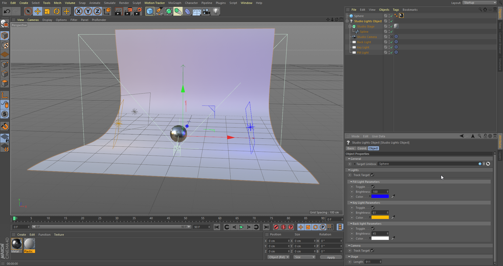
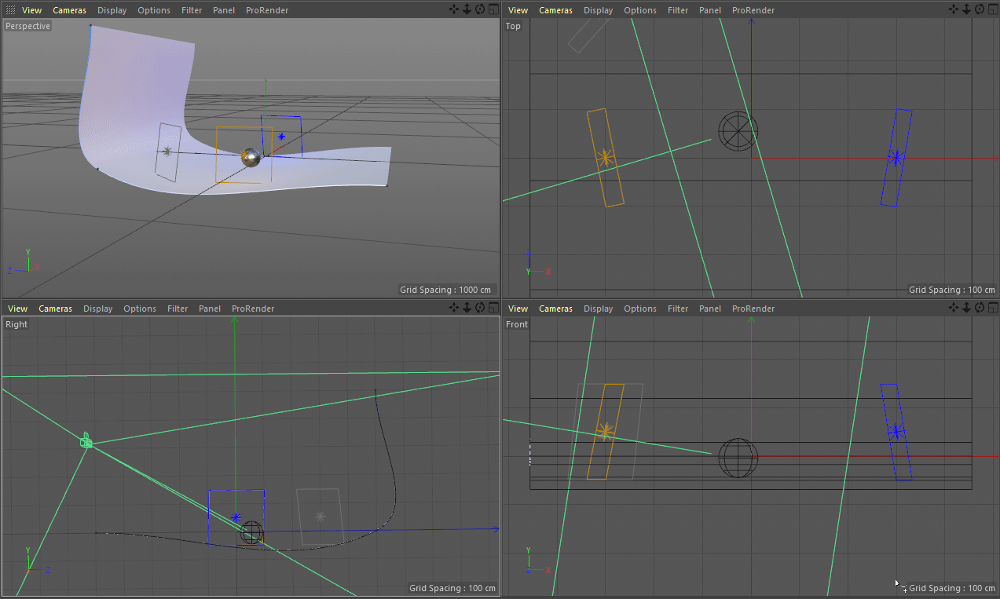

# StudioLights-c4dplugin
A simple plugin for Cinema4d

# Note
There is a bug with the light's parameters. It seems that changing the base container data for the light objects don't seem to work.

For example changing LIGHT_COLOR, LIGHT_BRIGHTNESS, or any light parameters doesn't seem to have any change.

Mp4 Download
[Demo Video](https://github.com/tucci/StudioLights-c4dplugin/blob/master/demo_vid.mp4)

